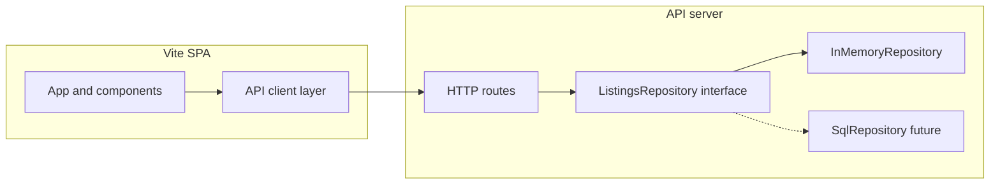

# Full-stack structure for Underground Artwork (DB last)

## Project charter (reminder)

**Mission:** Build the data and application layer for an **Underground Artwork** marketplace that bridges **buyers** (discover and purchase local art) and **independent artists / sellers** (structured listings and inventory). The platform also serves **guests** (browse without an account) and **admins** who reduce scams and inauthentic listings.

**Interactions the database must eventually support** (beyond basic listing fields like price, size, and medium):

- **Custom buyer requests** — structured buyer-to-seller requests tied to listings or artists.
- **User reviews** — ratings/feedback with integrity constraints (who can review whom, visibility).
- **Private messaging** — buyer/seller (and admin) threads with appropriate privacy and abuse controls.
- **Moderation** — admin workflows tied to users/listings (flags, takedowns, audit trail).

Early milestones still use an **API + repository abstraction** with an **in-memory** store so UI and HTTP contracts can progress before the full relational schema lands; the **final phase** expands repositories and migrations to match this charter.

## Current baseline (from codebase review)

- **Frontend:** [src/App.tsx](../src/App.tsx) owns all state; listings come from [src/data/listings.ts](../src/data/listings.ts); types in [src/types.ts](../src/types.ts).
- **Gaps:** No `fetch`, env, or routing; category strip, sort `<select>`, and filter price UI are partly unwired; favorites are `useState` only; map is decorative ([src/components/MapPanel.tsx](../src/components/MapPanel.tsx)).

The stack does **not** force a Next.js migration. **Recommended default:** keep **Vite SPA** and add a **small Node API** (simplest path for a class repo). Optionally adopt **Next.js** later if you need SEO-heavy public listing URLs, colocated Route Handlers, or a single deploy unit—treat that as an explicit product decision, not a requirement of today's code.

## Repository layout (single repo, monorepo-style)

Avoid two disconnected repos for a class project. Suggested structure **inside** `Underground-Artwork` (names adjustable):

- `apps/web` — today's Vite app (move existing `src`, `index.html`, `vite.config.ts` here), or keep root as `web` if you prefer minimal churn.
- `apps/api` — Node HTTP server (see below).
- `packages/shared` — **shared DTOs / Zod schemas** for `Listing`, query params, and API responses so frontend and backend do not drift (optional but high leverage).

Root `package.json` can use **npm workspaces** so `npm run dev` starts API + web via `concurrently` or similar.

## Git workflow and release policy

- **`main` is frozen** until the team agrees there is a **solid V1** (stable app,
  agreed scope). No merges or direct pushes to `main` before that gate.
- **All implementation** follows the plan’s milestones using **short-lived
  `feature/*` branches** cut from latest **`development`**, with PRs into
  **`development` only** until V1.
- After V1, keep the same pattern: **`feature/*` → `development`**; promote
  **`development` → `main`** only for deliberate releases.

See [CONTRIBUTING.md](../CONTRIBUTING.md) for branch naming and PR conventions.

## API shape (design now, DB later)

Define a **narrow, stable HTTP contract** that a future SQL repository can implement without changing the client:

- `GET /listings` — supports the same dimensions the UI already filters on: `search`, `medium`, `status`, `maxDistance`, optional `minPrice` / `maxPrice`, `sort`, `category` (once wired). **Add from day one:** pagination (`page`, `pageSize` with a hard **max page size**), validated query params via shared Zod schema, and **stable sort** (tie-breaker field such as `id`) so pages do not shuffle between requests.
- `GET /listings/:id`
- `PATCH /listings/:id` — reserved for **seller-owned** fields (e.g. `status`) once auth exists. **Do not** treat `saved` as a column on the listing for unauthenticated users (see Security review — IDOR / abuse). Prefer `POST /me/favorites` + `userId` (or session) after auth, or client-only favorites until then.
- `POST /contact` (stub) — body: listing id, message, contact hint; **no email integration required** for V1; log or in-memory store. **Rate limit** this route from the first implementation (abuse / spam).

**Implementation detail:** introduce a **`ListingsRepository` interface** oriented to **use cases**, not raw tables: e.g. `findListings(filters, pagination)`, `getListingById`, `updateListing` (narrow allowlist of patchable fields). Ship **`InMemoryListingsRepository`** seeded from the existing JSON/array (export seed from shared package or a `seed/listings.json`). Later, add **`SqlListingsRepository`** that runs the same methods against Postgres/MySQL—**no change to route handlers** if the interface is respected. Keep **DTO validation** separate from persistence row shape.

**CORS:** Allowlist origins from **environment variables** (e.g. `WEB_ORIGINS` comma-separated) — dev includes `http://localhost:5173`, prod lists the real SPA origin only. Avoid `*` when cookies or credentials are ever used.

**Server choice:** Fastify, Hono, or Express are all fine; pick one the team knows. Hono + `@hono/node-server` is compact; Fastify + Zod serializer is also a good fit with shared schemas.

## Frontend integration (after API exists)

- Add **`VITE_API_URL`** in Vite env; small **`src/lib/api.ts`** with typed `fetch` wrappers. **Never** put API keys, DB URLs, or signing secrets in `VITE_*` vars (they ship to the browser).
- Replace `useState(seedListings)` with **`useState` + `useEffect`/`useQuery`** to load from `GET /listings`; optimistic updates for favorites only after a **safe** server contract exists (authenticated favorites or agreed stub).
- **TanStack Query** (optional but recommended): cache keys must include **filters + page**; set sensible `staleTime` for listing reads; invalidate or update cache after mutations.
- **React Router** (or TanStack Router): `/`, `/listings/:id`, `/saved` so detail and saved views are deep-linkable (aligns with README "gallery marketplace" and future sharing).

## Product/UI work that pairs naturally with the API (still before DB)

Wire the controls that already exist in the UI to **real query params** on `GET /listings`:

- Sort (`newest` / `nearby` / `price`) — add `postedAt` or `createdAt` to the domain model when you stop using only mock rows (or derive sort keys from current seed).
- Category strip — add `category` on `Listing` in shared schema + filter.
- **FilterRail** counts — compute from current result set or from API `GET /listings/facets` later; start with client-side counts from returned list to avoid premature endpoints.

## Authentication (defer deep integration, stub boundary)

For class scope, delay full auth until after browse + listings are API-backed:

- **Phase A:** No auth; public read, optional cookie session later.
- **Phase B:** Add **session or JWT** for "Sign in"; protect seller `PATCH` and tie **per-user favorites** to `userId`. For **cookie-based** sessions, use `HttpOnly`, `Secure`, `SameSite` appropriately to reduce XSS/session theft risk. Use a placeholder provider or simple email+password with **strong password hashing** (e.g. Argon2/bcrypt) in DB **when DB lands**.

Document the **session shape** (e.g. `userId`, `role: buyer | seller`) in `packages/shared` so UI nav (`#signin`) can become real routes without rework.

## File / image handling (before or with DB)

Listings reference **`image: string` URLs** today (bundled assets). Before PostgreSQL:

- API serves **placeholder** URLs or static `/public` uploads folder with multer/form limits, **or** defer real uploads and keep bundled images until storage (S3, Vercel Blob, etc.) is chosen. If allowing uploads: enforce **type/size limits**, **randomized filenames**, no user-controlled paths (mitigate path traversal and malware drop).

## Security review (plan-threats and mitigations)

This is a **class / V1** scope review: prioritize cheap controls that prevent accidental wide-open production.

| Risk | Why it matters here | Mitigation in plan |
|------|---------------------|---------------------|
| **Unauthenticated `PATCH /listings/:id`** | Anyone could flip **`status`** or a global **`saved`** flag — classic **IDOR** and data integrity break. | Restrict patchable fields; **require auth** for seller status changes; model **favorites** as per-user rows (or keep favorites client-only until auth). |
| **`POST /contact` abuse** | Spam, DoS, harassment pipeline if wired to real email later. | **Rate limit** per IP (and stricter per user when auth exists); max body size; validate with Zod; consider CAPTCHA only if publicly abused. |
| **CORS misconfiguration** | `Access-Control-Allow-Origin: *` + credentials, or reflecting untrusted Origin, enables token theft patterns. | **Explicit allowlist** from env; no wildcard with cookies. |
| **Secrets in frontend** | Vite exposes `VITE_*` to all users. | API keys and `DATABASE_URL` **only** on server; document for the team. |
| **SQL injection (DB phase)** | ORM/query builder misuse still possible. | Parameterized queries / Prisma or Drizzle best practices; **no** string-concat SQL for filters. |
| **Mass assignment** | `PATCH` accepting full JSON objects could change unexpected fields. | **Allowlist** patch keys in Zod and repository layer. |
| **Verbose errors** | Stack traces and internal paths aid attackers. | **Structured JSON errors** for clients; log details server-side only; generic message in prod. |
| **Dependency risk** | Transitive vulns. | Lockfile + periodic `npm audit` / Dependabot (team process). |
| **Messaging / reviews IDOR** | Users could read others' threads or forge reviews. | Enforce **participant checks** on every message fetch; reviews tied to verifiable transactions or listing visibility rules; admins use **separate** auditable endpoints. |

**Out of scope for initial milestones but note:** if the API ever **fetches user-supplied URLs** (preview, import), guard against **SSRF**. File uploads need **content-type sniffing caution** (do not trust client MIME only).

## Scalability, robustness, and operations (full-stack review)

_Summary of a dedicated full-stack pass on this plan._

**Top risks**

1. **Mutation semantics** — Global listing `saved` conflates with per-user favorites; fix the domain model before exposing `PATCH`.
2. **Unbounded listings** — Without pagination and max limits, the API contract will not survive real data or SQL migration.
3. **Repository boundary** — Methods must match **query use cases** so the in-memory and SQL implementations stay interchangeable.
4. **Operational gaps** — Add **`GET /health`**, startup **fail-fast** on missing required env vars, request logging, and predictable **400/404/500** + validation errors.
5. **Caching** — TanStack Query `staleTime` + correct query keys; optional future **Cache-Control** on public reads if listings are mostly static.

**Fine for V1 class scope**

Monorepo layout, Zod in `packages/shared`, deferring PostgreSQL and full auth **if** the repository interface and HTTP contract are disciplined (pagination, validation, no world-writable `PATCH`).

## Final phase: database (when everything else is stable)

Align the schema with **roles** (guest is often "no row" or anonymous session; **buyer**, **seller**, **admin** as authenticated profiles) and the **interaction** entities above.

1. **Choose DB** — PostgreSQL recommended (relational integrity across listings, users, messages, and moderation).
2. **Schema + migrations** — Core tables at minimum:
   - **Users / profiles** with `role` (and seller-specific fields as needed).
   - **Listings** (price, dimensions, medium, status, approximate location, images).
   - **Favorites** (per-user, per-listing).
   - **Buyer requests** (buyer, seller or listing target, status, payload).
   - **Reviews** (subject listing or seller, reviewer, rating, text, visibility/moderation state).
   - **Messages** (threads or pairwise, participants, encrypted-at-rest optional for class scope; **never** expose other users' threads without auth checks).
   - **Moderation** (reports, admin actions, linkage to listing/user, timestamps for audit).
   Map public **`Listing` DTOs** in repository mappers—**do not** expose raw table shapes to the client.
3. **Repositories** — Extend beyond `SqlListingsRepository` to dedicated repositories or a bounded domain layer for **messages**, **reviews**, and **admin** operations; keep route handlers thin.
4. **Swap implementations** — In-memory implementations used in tests or demos give feature parity with SQL where feasible; seed scripts for dev.
5. **Deploy:** web static host + API; `DATABASE_URL` and secrets only on the server.

## Suggested implementation order

1. Scaffold `apps/api` + repository interface + in-memory seed + validated **`GET /listings`** (pagination, max limit) + **`GET /listings/:id`** + **`GET /health`**; env-driven CORS; structured errors. **`PATCH` only for fields you can justify** (prefer deferring seller writes until auth). **`POST /contact`** with rate limit.
2. Extract shared types/schemas to `packages/shared` (Zod for query params, pagination response, listing DTO).
3. Point Vite app at API; TanStack Query with filter/page cache keys; loading/error states; favorites **only** via a safe pattern (client-only stub or authenticated `favorites` API).
4. Add React Router and wire sort/category/price to API query params; align filters with future **indexed** SQL columns where possible.
5. Stub or implement session/JWT + protected seller routes; tighten `POST /contact` limits per authenticated user.
6. **Last:** PostgreSQL + migrations + `SqlListingsRepository` + password hashing and persistence for auth.

## Risks / decisions to revisit

- **Monolith vs SPA+API:** Staying SPA+API minimizes refactor of [src/App.tsx](../src/App.tsx); Next.js is optional for SEO/server rendering.
- **tRPC vs REST:** REST + OpenAPI or Zod-shared DTOs is enough; tRPC is nice if both ends are TypeScript and you want end-to-end types without codegen.
- **Map:** Real lat/lng + MapLibre/Mapbox is a separate slice; keep mock map until geo fields exist in the domain model.
